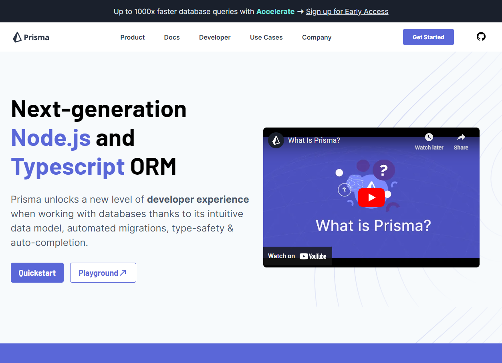
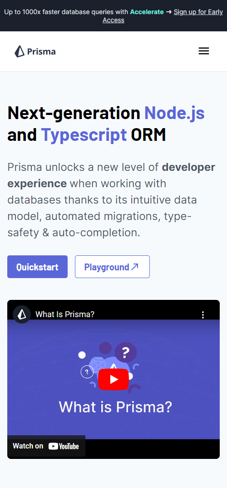

<h1 align="center">PRISMA ORM CLONE</h1>

<h2 align="center">Summary</h2>

    <a href="#about">📙 About</a>
    <a href="#preview">🖼️ Preview</a>
    <a href="#technologies">💻 Technologies</a>

<h4 align="center">
   🚧 Prisma ORM clone project in progress 🚧
</h4>

<H2 id="about">📙 About</H2>

Front page layout clone from Prisma ORM original website implemented with React library.

Originally created by <a href="https://www.linkedin.com/in/kleverson-kenji-iwatani/">Kenji Iwatani</a>

---

<h2 id="preview">🖼️ Preview</h2>

<h4>Desktop overview:</h4>
<section align="center">
    
</section>

<h4>Mobile overview:</h4>
<section align="center">
    
</section>

---

<H2 id="technologies">💻 Technologies</H2>

- [x] <a href="https://legacy.reactjs.org/">React</a>
- [x] <a href="https://www.typescriptlang.org/">Typescript</a>
- [x] <a href="https://mui.com/">MUI</a>
